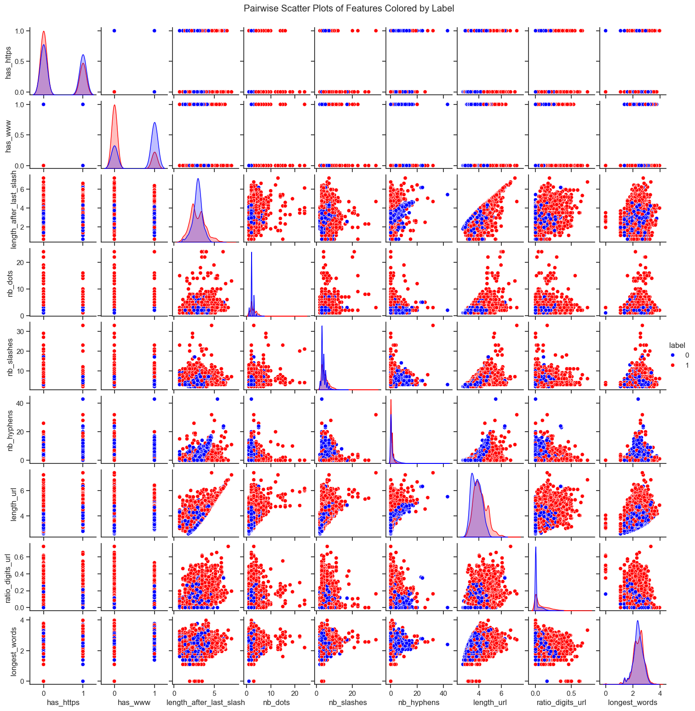
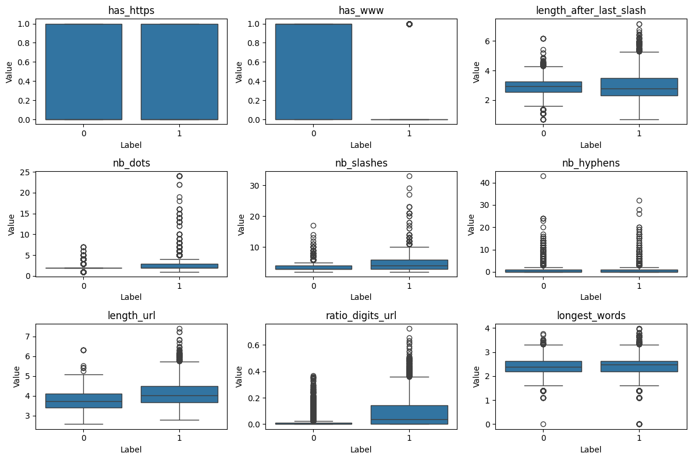

# NLP & Phishing URL Classification Project

This repository contains exercises on text and URL classification using **Machine Learning**. The goal is to preprocess datasets, extract features, and evaluate models like **Logistic Regression** and **Naive Bayes** on binary classification tasks.

---

## Table of Contents

1. [Email Spam Classification](#email-spam-classification)
2. [Feature Engineering for URLs](#feature-engineering-for-urls)
3. [Model Implementation](#model-implementation)
4. [Results and Analysis](#results-and-analysis)
5. [Feature Correlation & Visualization](#feature-correlation--visualization)
6. [Visual Examples](#visual-examples)
7. [Requirements](#requirements)

---

## Email Spam Classification

### Dataset

- `emails_1.csv`: raw email dataset
  - `text`: email content
  - `status`: spam or ham
- `emails_2.csv`: preprocessed Bag-of-Words (BoW) representation with 3000 most frequent words and `Prediction` label

### Preprocessing

1. Convert labels to numeric: `spam → 1`, `ham → 0`
2. Clean text: lowercase, remove non-alphabetic characters
3. Generate **Bag-of-Words** representation

### Train-Test Split

- Stratified split to preserve **spam/ham ratio (~29% spam, ~71% ham)**
- `Train size: 4138`, `Test size: 1034`

---

## Feature Engineering for URLs

### Features Extracted

#### Statistical Features

- `length_url`: total URL length
- `ratio_digits_url`: fraction of digits in URL
- `longest_words`: length of the longest alphabetic word

#### Log-transformed Features

- `length_url_log = log1p(length_url)`
- `longest_words_log = log1p(longest_words)`

#### Heuristic / Character Features (New Features)

- `has_https`: 1 if URL starts with `https://`, else 0
- `has_www`: 1 if URL contains `www`
- `length_after_last_slash`: log-transformed length of string after last `/`

> These three heuristic features may help detect phishing URLs because:
>
> - `has_https`: secure URLs are less likely to be phishing
> - `has_www`: patterns in domain naming can indicate legitimacy
> - `length_after_last_slash`: phishing URLs often use long paths

---

## Model Implementation

- **Logistic Regression**: binary classification, trained with gradient descent, loss: Binary Cross-Entropy
- **Naive Bayes**:
  - **GaussianNB** for continuous features
  - **MultinomialNB** for discrete / count features

### Metrics

- Accuracy, Precision, Recall, F1-Score

---

## Results and Analysis

### URL Classification (3 heuristic features: `has_https`, `has_www`, `length_after_last_slash`)

| Model               | Accuracy | Precision | Recall | F1 Score |
| ------------------- | -------- | --------- | ------ | -------- |
| Logistic Regression | 0.7297   | 0.7033    | 0.7944 | 0.7461   |
| Gaussian NB         | 0.7358   | 0.7016    | 0.8206 | 0.7565   |
| Multinomial NB      | 0.7297   | 0.7033    | 0.7944 | 0.7461   |

**Observation:**

- GaussianNB slightly outperforms others for these continuous features.
- Logistic Regression and Multinomial NB perform similarly.
- Log-transformation helps stabilize skewed features.

### Email Spam Classification Results (example)

| Model               | Accuracy | Precision | Recall | F1 Score |
| ------------------- | -------- | --------- | ------ | -------- |
| Logistic Regression | 0.9642   | 0.9256    | 0.9533 | 0.9392   |
| Multinomial NB      | 0.9371   | 0.8638    | 0.9300 | 0.8957   |

---

## Feature Correlation & Visualization

- Binary features (`has_https`, `has_www`) mostly independent
- Length-related and count features moderately correlated (`length_url`, `nb_dots`, `nb_slashes`)
- Ratio of digits adds signal for numeric-heavy URLs
- Longest alphabetic word provides additional information

**Visualizations included:**

- Correlation heatmap: `images/pic1.png`
- Boxplots / violin plots per feature vs label: `images/pic2.png`

---

## Visual Examples

### Scatter plot of 36 feature pairs



### Box plots (3x3) for features vs label



---

## Requirements

```bash
Python >= 3.8
pandas
numpy
matplotlib
seaborn
scikit-learn
```
